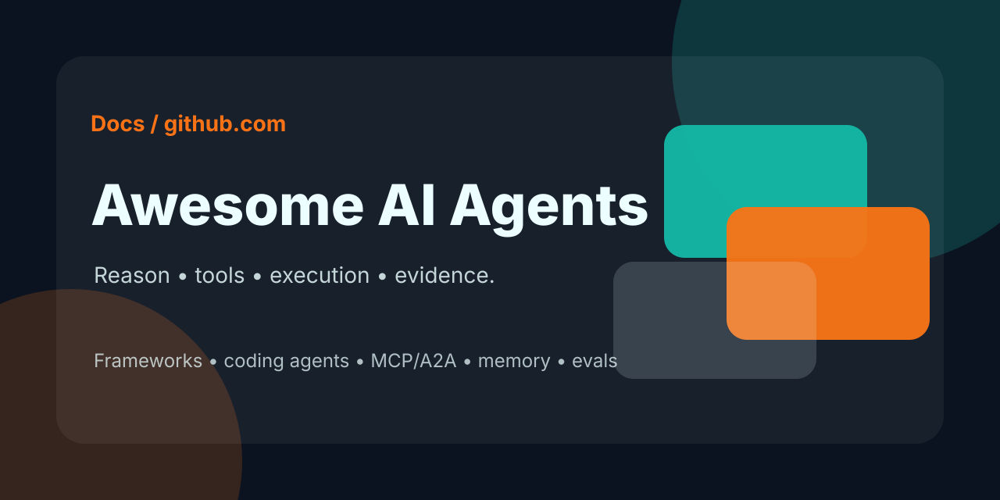
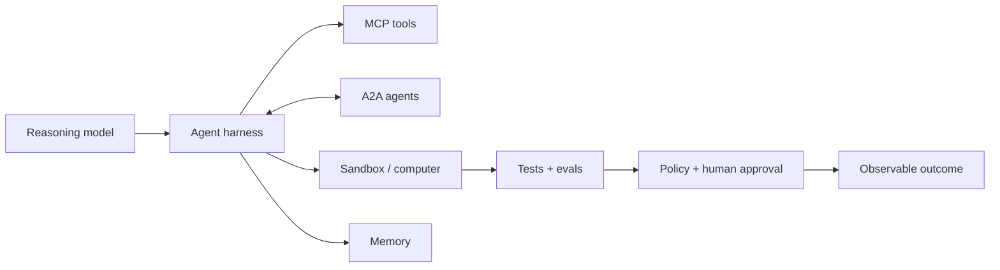

# Awesome AI Agents

### The practical frontier index for agents that can reason, use tools, change software, and operate safely.

   

**Frameworks · coding agents · MCP/A2A · memory · evals · security · deployment**

> A deliberately short, source-linked map of the agent stack that is useful now. Discovery signals help us find candidates; upstream documentation, active maintenance, and a concrete job decide inclusion.

## 60-second map

| If you want to… | Start here | Then add |
|---|---|---|
| Build an agent | [OpenAI Agents SDK](https://github.com/openai/openai-agents-python), [Google ADK](https://github.com/google/adk-python), [Pydantic AI](https://github.com/pydantic/pydantic-ai) | [MCP](https://modelcontextprotocol.io/specification/latest), tracing, evals |
| Ship code with an agent | [Codex](https://github.com/openai/codex), [Claude Code](https://github.com/anthropics/claude-code), [OpenCode](https://github.com/anomalyco/opencode), [Gemini CLI](https://github.com/google-gemini/gemini-cli) | sandbox, tests, review gate |
| Connect tools and data | [MCP](https://modelcontextprotocol.io/specification/latest) | allowlists, auth, audit logs |
| Delegate between agents | [A2A](https://a2a-protocol.org/latest/) | capability cards, typed artifacts, timeouts |
| Give agents durable context | [Synapse](https://github.com/Supersynergy/synapse-memory), [Mem0](https://github.com/mem0ai/mem0), [Letta](https://github.com/letta-ai/letta) | retention, deletion, provenance |
| Prove that it works | [Terminal-Bench](https://github.com/harbor-framework/terminal-bench), [BrowserGym](https://github.com/ServiceNow/BrowserGym), [SWE-bench](https://github.com/SWE-bench/SWE-bench) | traces, cost, human intervention |

## Frontier radar

The newest meaningful shift is not “more chat.” It is a tighter execution loop: model → tools → environment → tests → evidence → approval.

| Frontier | What changed | Strong current anchors |
|---|---|---|
| **Long-horizon work** | Agents increasingly own a bounded task over minutes or hours, with parallel workers and explicit verification. | [Codex agent loop](https://openai.com/index/unrolling-the-codex-agent-loop/), [Agents SDK sandboxes](https://openai.com/index/the-next-evolution-of-the-agents-sdk/), [Claude Code research](https://www.anthropic.com/research/claude-code-expertise?level=0) |
| **Open interoperability** | Tool access and agent-to-agent collaboration are separating into complementary protocol layers: MCP and A2A. | [MCP specification](https://modelcontextprotocol.io/specification/latest), [A2A specification](https://a2a-protocol.org/latest/specification/), [Agentic AI Foundation](https://www.linuxfoundation.org/press/linux-foundation-announces-the-formation-of-the-agentic-ai-foundation?hs_amp=true) |
| **Computer Use** | GUI interaction is becoming a general action surface alongside APIs and terminals; reliability and safety remain first-class engineering problems. | [OpenAI CUA](https://openai.com/index/computer-using-agent/), [OpenCUA](https://github.com/xlang-ai/OpenCUA), [BrowserGym](https://github.com/ServiceNow/BrowserGym) |
| **Stateful memory** | Memory is moving from “paste more context” to explicit state, retrieval, temporal reasoning, and long-lived agent identity. | [Mem0 memory algorithm](https://github.com/mem0ai/mem0), [Letta](https://github.com/letta-ai/letta), [Letta Code](https://github.com/letta-ai/letta-code) |
| **Environment-first evals** | Agent quality is being measured by completed tasks in real terminals, browsers, and repositories—not by chat transcripts alone. | [Terminal-Bench](https://github.com/harbor-framework/terminal-bench), [BrowserGym](https://github.com/ServiceNow/BrowserGym), [SWE-bench](https://github.com/SWE-bench/SWE-bench) |
| **Governed autonomy** | Sandboxes, approval gates, telemetry, and misalignment monitoring are becoming part of the agent runtime itself. | [Running Codex safely](https://openai.com/index/running-codex-safely/), [monitoring coding agents](https://openai.com/index/how-we-monitor-internal-coding-agents-misalignment/), [E2B](https://github.com/e2b-dev/E2B) |

For the detailed research notes, source links, and evidence boundaries, see the [2 August update audit](docs/UPDATE-2026-08-02.md) and the earlier [frontier breakthroughs](docs/FRONTIER-BREAKTHROUGHS-2026-07-14.md).

## Contents

1. [Agent frameworks](#agent-frameworks)
2. [Agent runtimes and platforms](#agent-runtimes-and-platforms)
3. [Coding agents](#coding-agents)
4. [Protocols and standards](#protocols-and-standards)
5. [Agent skills and repo context](#agent-skills-and-repo-context)
6. [Multi-agent patterns](#multi-agent-patterns)
7. [Agent memory](#agent-memory)
8. [Observability and evaluation](#observability-and-evaluation)
9. [Security and guardrails](#security-and-guardrails)
10. [Voice agents](#voice-agents)
11. [Deployment and sandboxing](#deployment-and-sandboxing)
12. [Knowledge and retrieval](#knowledge-and-retrieval)
13. [Live signals](#live-signals)
14. [Related awesome lists](#related-awesome-lists)
15. [Contributing](#contributing)

## Agent frameworks

| Framework | Stars snapshot | Best fit |
|---|---:|---|
| [OpenAI Agents SDK](https://github.com/openai/openai-agents-python) | 28.3K | Lightweight agents, tools, handoffs, tracing, and sandboxed work |
| [Claude Agent SDK for Python](https://github.com/anthropics/claude-agent-sdk-python) | 7.8K | Building around Claude Code primitives and tool use |
| [Google ADK](https://github.com/google/adk-python) | 21.0K | Code-first agents, evaluation, deployment, and Google model integration |
| [Pydantic AI](https://github.com/pydantic/pydantic-ai) | 19.0K | Type-safe agents and validated structured output |
| [Mastra](https://github.com/mastra-ai/mastra) | 26.8K | TypeScript agents, workflows, memory, and observability |
| [smolagents](https://github.com/huggingface/smolagents) | 28.6K | Small code-first agents and `CodeAgent` workflows |
| [Agno](https://github.com/agno-agi/agno) | 41.5K | Model-agnostic agents with tools, knowledge, and memory |
| [mcp-agent](https://github.com/lastmile-ai/mcp-agent) | 8.5K | MCP-native agents and compact workflow patterns |
| [Vercel Eve](https://github.com/vercel/eve) | 4.2K | Filesystem-first durable agents; currently beta |
| [Omnigent](https://github.com/omnigent-ai/omnigent) | 8.0K | Meta-harness for interoperable coding agents and policy controls |
| [Open Multi-Agent](https://github.com/open-multi-agent/open-multi-agent) | 6.7K | TypeScript orchestration with runtime-planned task DAGs |
| [Archestra](https://github.com/archestra-ai/archestra) | 4.1K | MCP/A2A gateway, registry, orchestrator, and guardrails |

## Agent runtimes and platforms

| Runtime | Delivery | Use case |
|---|---|---|
| [OpenClaw](https://github.com/openclaw/openclaw) | Self-hosted | Personal assistants, channels, skills, memory, and tool orchestration |
| [Goose](https://github.com/aaif-goose/goose) | Local / self-hosted | Extensible agent with MCP and any-LLM support |
| [OpenHands](https://github.com/OpenHands/OpenHands) | Open source | Software-development agents and sandboxed execution |
| [NVIDIA OpenShell](https://github.com/NVIDIA/OpenShell) | Self-hosted / alpha | Policy-governed private sandboxes for autonomous agents |
| [Docker Agent](https://github.com/docker/docker-agent) | Docker Desktop / self-hosted | Declarative YAML agents, MCP tools, and multi-agent runs |
| [Kun](https://github.com/KunAgent/Kun) | Local-first | Desktop/TUI workspace for coding, writing, research, and automation |
| [Mission Control](https://github.com/builderz-labs/mission-control) | Self-hosted | Dispatch, review, spend tracking, and operations across agent runtimes |
| [OpenAI Deep Research](https://openai.com/index/introducing-deep-research/) | Hosted | Long-running, citation-oriented research |
| [Gemini Deep Research](https://gemini.google.com/) | Hosted | Research tasks in the Google ecosystem |
| [Manus](https://manus.im/) | Hosted | General-purpose autonomous task execution |
| [Replit Agent](https://replit.com/ai) | Hosted | Build and deploy applications from natural language |
| [v0](https://v0.dev/) | Hosted | UI and application generation |
| [Lovable](https://lovable.dev/) | Hosted | Product-oriented application prototyping |

### Lightweight and always-on runtimes

Current GitHub snapshots checked **2 August 2026**. Stars indicate attention, not reliability.

| Runtime | Stars | Language / shape | Best fit |
|---|---:|---|---|
| [Hermes Agent](https://github.com/NousResearch/hermes-agent) | 223.8K | Python / local agent | Personal workflows, skills, browser use, and long-lived learning |
| [nanobot](https://github.com/HKUDS/nanobot) | 46.5K | Python / lightweight | Small open-source agent for tools, chats, and workflows |
| [ZeroClaw](https://github.com/zeroclaw-labs/zeroclaw) | 32.5K | Rust / single binary | Low-overhead personal assistant with channels, MCP, memory, ACP, and policy gates |
| [NanoClaw](https://github.com/nanocoai/nanoclaw) | 30.4K | TypeScript / containers | OpenClaw-like channels with container isolation and memory |
| [PicoClaw](https://github.com/sipeed/picoclaw) | 29.8K | Go / tiny runtime | Small hardware and deploy-anywhere assistant scenarios |
| [IronClaw](https://github.com/nearai/ironclaw) | 12.6K | Rust / Agent OS | Privacy, security, and extensibility as the runtime boundary |
| [NullClaw](https://github.com/nullclaw/nullclaw) | 8.0K | Zig / minimal runtime | Small autonomous assistant infrastructure |

### New runtime and control-plane candidates

These projects were surfaced by ghmax and verified against active official repositories. They are useful additions, but a live repository and star count are not a production-readiness claim.

| Project | Stars | Shape | Best fit |
|---|---:|---|---|
| [herdr](https://github.com/herdrdev/herdr) | 23.4K | Rust / terminal runtime | Workspaces and lifecycle management for coding-agent fleets |
| [holaOS](https://github.com/holaboss-ai/holaOS) | 5.5K | TypeScript / agent workspace | Shared memory and MCP across apps, files, and browsers |
| [Archestra](https://github.com/archestra-ai/archestra) | 4.1K | TypeScript / gateway | Controlled enterprise access to MCP, A2A, and agent triggers |
| [Open Multi-Agent](https://github.com/open-multi-agent/open-multi-agent) | 6.7K | TypeScript / orchestrator | Dynamic multi-agent workflows in a Node.js application |

## Coding agents

| Agent | Stars snapshot | Interface | Strength |
|---|---:|---|---|
| [OpenCode](https://github.com/anomalyco/opencode) | 192.0K | Terminal | Open-source, model-agnostic coding agent |
| [Claude Code](https://github.com/anthropics/claude-code) | 139.9K | Terminal | Repository-aware coding, hooks, and agent workflows |
| [Gemini CLI](https://github.com/google-gemini/gemini-cli) | 106.3K | Terminal | Open-source Gemini agent with terminal and MCP workflows |
| [Codex](https://github.com/openai/codex) | 103.1K | Terminal | Open-source terminal agent with sandboxed execution |
| [OpenHands](https://github.com/OpenHands/OpenHands) | 82.8K | Web / CLI | Autonomous software-development workflows |
| [Cline](https://github.com/cline/cline) | 65.4K | VS Code / CLI / SDK | Model-agnostic tool execution and coding |
| [Open Interpreter](https://github.com/openinterpreter/openinterpreter) | 67.5K | Terminal / CLI | Code-capable agent for open models |
| [Aider](https://github.com/Aider-AI/aider) | 47.9K | Terminal | Git-aware pair programming and repository edits |
| [Orca](https://github.com/stablyai/orca) | 35.2K | Desktop / mobile / VPS | Parallel coding-agent fleet management |
| [Qwen Code](https://github.com/QwenLM/qwen-code) | 26.5K | Terminal | Open-source terminal coding agent |
| [pi](https://github.com/earendil-works/pi) | 81.9K | TUI / CLI toolkit | Unified LLM API, agent loop, and coding CLI |
| [Kimi CLI](https://github.com/MoonshotAI/kimi-cli) | 11.1K | Terminal | Planning and coding workflows |
| [Chorus](https://github.com/chorus-codes/chorus) | 525 | CLI harness | Multi-LLM peer review before shipping code |

### Coding-agent ecosystem

[Claude Code Router](https://github.com/musistudio/claude-code-router) · [Claude Code Templates](https://github.com/davila7/claude-code-templates) · [SWE-agent](https://github.com/SWE-agent/SWE-agent) · [GitHub Copilot](https://github.com/features/copilot) · [Cursor](https://cursor.com/) · [Windsurf](https://windsurf.com/)

## Protocols and standards

| Protocol | Purpose |
|---|---|
| [Model Context Protocol (MCP)](https://modelcontextprotocol.io/specification/latest) | Connect agents to tools, data, prompts, and resources |
| [MCP Servers](https://github.com/modelcontextprotocol/servers) | Official reference servers and implementation examples |
| [Agent2Agent (A2A)](https://a2a-protocol.org/latest/) | Discover, delegate, and exchange artifacts between opaque agents |
| [OpenAI function calling](https://platform.openai.com/docs/guides/function-calling) | Structured tool calls and schema-constrained actions |
| [Anthropic tool use](https://docs.anthropic.com/en/docs/build-with-claude/tool-use) | Model-directed tools and structured results |
| [Agent Client Protocol (ACP)](https://github.com/agentclientprotocol/agent-client-protocol) | Connect editors and agent runtimes through a common protocol |
| [AGENTS.md](https://github.com/agentsmd/agents.md) | Portable repository guidance for coding agents |

**Mental model:** MCP is the agent-to-tool boundary. A2A is the agent-to-agent boundary. They solve different problems and compose cleanly.

## Agent skills and repo context

| Project | Role |
|---|---|
| [Superpowers](https://github.com/obra/superpowers) | Agentic skills framework and software-development methodology |
| [Understand-Anything](https://github.com/Egonex-AI/Understand-Anything) | Interactive codebase knowledge graph for Claude Code, Codex, Cursor, Copilot, and Gemini CLI |
| [AGENTS.md](https://github.com/agentsmd/agents.md) | Keep project-specific constraints, workflows, and safety context close to the repository |

Skills are executable context, not decoration: prefer scoped permissions, explicit stop conditions, and a testable outcome.

## Multi-agent patterns

| Pattern | Use when | Control that must exist |
|---|---|---|
| **Pipeline** | Steps are known and ordered | Explicit state between stages |
| **Orchestrator / worker** | Work can be split across specialists | Central planner, bounded workers |
| **Handoff** | A specialist should own the next turn | Typed transfer and stop conditions |
| **Debate / critique** | A second opinion reduces costly errors | Independent proposal and review |
| **Reflection** | Output can be checked and improved | Separate verifier and retry budget |
| **Human approval** | Actions are costly or irreversible | Approval gate before side effects |

Production rule: define a closed task, machine-checkable oracle, maximum step count, and explicit stop path before adding more agents.

## Agent memory

| Tool | Stars snapshot | Focus |
|---|---:|---|
| [Mem0](https://github.com/mem0ai/mem0) | 62.3K | Cross-session memory, temporal retrieval, and agent context |
| [Letta](https://github.com/letta-ai/letta) | 24.0K | Stateful agents and editable long-term memory |
| [Cognee](https://github.com/topoteretes/cognee) | 29.7K | Self-hosted knowledge graph and persistent agent memory |
| [TencentDB-Agent-Memory](https://github.com/TencentCloud/TencentDB-Agent-Memory) | 10.3K | Agent-memory storage and retrieval patterns |
| [OpenViking](https://github.com/volcengine/OpenViking) | 27.7K | Filesystem-shaped context database for memory, RAG, and skills |
| [Synapse](https://github.com/Supersynergy/synapse-memory) | 1 | Local-first cited memory, decisions, context packs, and recovery checkpoints in SQLite |

Memory is a product decision, not a vector-store checkbox: define retention, deletion, tenant boundaries, provenance, and recovery before shipping.

## Observability and evaluation

| Tool / benchmark | Focus |
|---|---|
| [Langfuse](https://github.com/langfuse/langfuse) | 32.3K; open-source traces, evals, prompts, datasets, and metrics |
| [Arize Phoenix](https://github.com/Arize-ai/phoenix) | 10.9K; AI observability and evaluation |
| [OpenTelemetry](https://opentelemetry.io/) | Vendor-neutral traces, metrics, and logs |
| [Terminal-Bench](https://github.com/harbor-framework/terminal-bench) | 2.5K; real terminal tasks with tests and execution harness |
| [BrowserGym](https://github.com/ServiceNow/BrowserGym) | 1.3K; web-agent research across browser benchmarks |
| [SWE-bench](https://github.com/SWE-bench/SWE-bench) | 5.5K; reproducible software-engineering tasks |
| [Mission Control](https://github.com/builderz-labs/mission-control) | Agent operations, dispatch, review, and spend tracking |

Track task success, tool success, latency, token cost, retries, human interventions, and unsafe-action attempts. A transcript alone is not an evaluation.

## Security and guardrails

[NVIDIA NeMo Guardrails](https://github.com/NVIDIA-NeMo/Guardrails) · [Guardrails AI](https://github.com/guardrails-ai/guardrails) · [Snyk Agent Scan](https://github.com/snyk/agent-scan) · [garak](https://github.com/NVIDIA/garak) · [Microsoft Presidio](https://github.com/microsoft/presidio)

Minimum controls: least-privilege tool scopes, server allowlists, validated tool output, sandboxing, egress limits, max steps, cost limits, audit logs, and human approval for irreversible actions.

## Voice agents

[LiveKit Agents](https://github.com/livekit/agents) · [OpenAI Realtime API](https://platform.openai.com/docs/guides/realtime) · [Vapi](https://vapi.ai/) · [Retell AI](https://www.retellai.com/) · [ElevenLabs Conversational AI](https://elevenlabs.io/conversational-ai)

## Deployment and sandboxing

| Tool | Use case |
|---|---|
| [NVIDIA OpenShell](https://github.com/NVIDIA/OpenShell) | Declarative filesystem, process, network, and inference policies for agent sandboxes; alpha |
| [OpenSandbox](https://github.com/opensandbox-group/OpenSandbox) | Secure, extensible sandbox runtime with coding-agent and Kubernetes examples |
| [Docker Agent](https://github.com/docker/docker-agent) | YAML-defined agents, multi-agent orchestration, and MCP tools in Docker |
| [E2B](https://github.com/e2b-dev/E2B) | Secure environments for agent-generated code |
| [Ollama](https://github.com/ollama/ollama) | Local model serving and developer workflows |
| [llama.cpp](https://github.com/ggml-org/llama.cpp) | Portable local inference |
| [vLLM](https://github.com/vllm-project/vllm) | High-throughput model serving |
| [Modal](https://modal.com/) | Serverless compute for agent and model workloads |
| [BentoML](https://github.com/bentoml/BentoML) | Packaging and serving model-backed applications |

Sandbox untrusted code. Treat model output as data until a policy layer validates the action.

## Knowledge and retrieval

| Tool | Focus |
|---|---|
| [Qdrant](https://github.com/qdrant/qdrant) | Filterable vector search and retrieval |
| [pgvector](https://github.com/pgvector/pgvector) | Vector search inside PostgreSQL |
| [Haystack](https://github.com/deepset-ai/haystack) | Modular search, RAG, and agent pipelines |
| [DSPy](https://github.com/stanfordnlp/dspy) | Programmatic prompt and LM optimisation |
| [LlamaIndex](https://github.com/run-llama/llama_index) | Data connectors, indexing, and retrieval workflows |
| [Understand-Anything](https://github.com/Egonex-AI/Understand-Anything) | Codebase graph and interactive repository understanding for agent workflows |
| [OpenViking](https://github.com/volcengine/OpenViking) | Context database that unifies agent memory, knowledge, and skills |
| [CodeGraph](https://github.com/colbymchenry/codegraph) | Local code knowledge graph for coding-agent retrieval and change context |

Choose storage by deletion semantics, tenant isolation, filter support, provenance, and operational cost—not by embedding demos alone.

## Live signals

This section is deliberately separate from the curated core.

- **ghmax / GitStars.io:** the 2 August run returned [OpenCode](https://github.com/anomalyco/opencode) at `+2,259 stars / 7d` and [OpenClaw](https://github.com/openclaw/openclaw) at `+694 / 7d`. The feed also contained unrelated repositories, so star velocity is discovery only.
- **ghmax repository search:** fresh, active candidates included [NVIDIA OpenShell](https://github.com/NVIDIA/OpenShell), [Archestra](https://github.com/archestra-ai/archestra), [Docker Agent](https://github.com/docker/docker-agent), [Kun](https://github.com/KunAgent/Kun), [herdr](https://github.com/herdrdev/herdr), and [Open Multi-Agent](https://github.com/open-multi-agent/open-multi-agent).
- **PUM:** the read-only refresh completed with `924` installed package records and `124` update candidates. PUM checks host/tool freshness; it is not a quality score for repositories.
- **Superweb:** current comparison-list retrieval surfaced [Zijian-Ni](https://github.com/Zijian-Ni/awesome-ai-agents-2026), [caramaschiHG](https://github.com/caramaschiHG/awesome-ai-agents-2026), [ARUNAGIRINATHAN-K](https://github.com/ARUNAGIRINATHAN-K/awesome-ai-agents-2026), and [awesome-agentic-mcp-security](https://github.com/mcp-security-project/awesome-agentic-mcp-security).
- **Synapse:** local-first memory is now a first-class category through [Supersynergy/synapse-memory](https://github.com/Supersynergy/synapse-memory), alongside hosted/stateful memory systems.
- **GitHub:** star counts above are dated adoption signals, not quality scores. Verify upstream activity before choosing.
- **Comparison lists:** [E2B](https://github.com/e2b-dev/awesome-ai-agents), [Zijian-Ni](https://github.com/Zijian-Ni/awesome-ai-agents-2026), [caramaschiHG](https://github.com/caramaschiHG/awesome-ai-agents-2026), [ARUNAGIRINATHAN-K](https://github.com/ARUNAGIRINATHAN-K/awesome-ai-agents-2026), [awesome-claude-code](https://github.com/hesreallyhim/awesome-claude-code), [awesome-mcp-servers](https://github.com/punkpeye/awesome-mcp-servers), and [awesome-agentic-mcp-security](https://github.com/mcp-security-project/awesome-agentic-mcp-security) were cross-checked.
- **YouTube:** current discovery clusters around agentic engineering, MCP versus APIs/skills, agent teams, and local terminal workflows. Video popularity is discovery only, never inclusion evidence.

See the [2 August audit](docs/UPDATE-2026-08-02.md) for exact snapshots, commands, search limits, and inclusion decisions.

## Related awesome lists

| List | Focus |
|---|---|
| [e2b-dev/awesome-ai-agents](https://github.com/e2b-dev/awesome-ai-agents) | Broad open- and closed-source agent directory |
| [caramaschiHG/awesome-ai-agents-2026](https://github.com/caramaschiHG/awesome-ai-agents-2026) | Broad catalog and category recall |
| [Zijian-Ni/awesome-ai-agents-2026](https://github.com/Zijian-Ni/awesome-ai-agents-2026) | Multilingual catalog with changelog and archive flags |
| [ARUNAGIRINATHAN-K/awesome-ai-agents-2026](https://github.com/ARUNAGIRINATHAN-K/awesome-ai-agents-2026) | Broad stack with security, observability, and deployment lanes |
| [Deep-Insight-Labs/awesome-ai-agents](https://github.com/Deep-Insight-Labs/awesome-ai-agents) | Frameworks, observability, and emerging projects |
| [hesreallyhim/awesome-claude-code](https://github.com/hesreallyhim/awesome-claude-code) | Claude Code skills, plugins, agents, and tooling |
| [punkpeye/awesome-mcp-servers](https://github.com/punkpeye/awesome-mcp-servers) | MCP server discovery |
| [mcp-security-project/awesome-agentic-mcp-security](https://github.com/mcp-security-project/awesome-agentic-mcp-security) | MCP and agentic security research, tooling, labs, and advisories |
| [e2b-dev/awesome-ai-sdks](https://github.com/e2b-dev/awesome-ai-sdks) | SDKs and building blocks |

Use broad lists for recall. Use this index's dated audit and upstream links for currentness.

## Contributing

Before adding an entry:

1. Link to the official upstream or product documentation.
2. State one concrete capability and one target user/use case.
3. Check that the project is active, documented, and not archived.
4. Avoid unsupported market share, benchmark, pricing, or adoption claims.
5. Add the date and source when a claim is time-sensitive.

PRs are welcome. See [CONTRIBUTING.md](CONTRIBUTING.md).

## License

MIT License — see [LICENSE](LICENSE).

**Checked 2 August 2026** · [Contributing guide](CONTRIBUTING.md) · [Audit](docs/UPDATE-2026-08-02.md)
