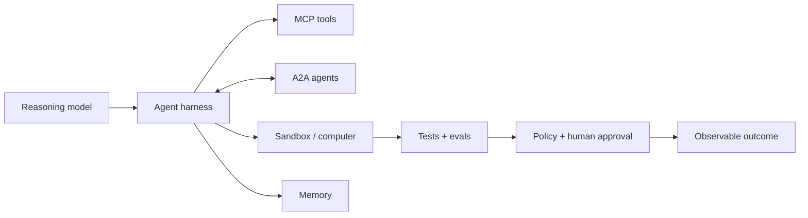

# Awesome AI Agents

### The practical frontier index for agents that can reason, use tools, change software, and operate safely.

   

**Frameworks · coding agents · MCP/A2A · memory · evals · security · deployment**

> A deliberately short, source-linked map of the agent stack that is useful now. Discovery signals help us find candidates; upstream documentation, active maintenance, and a concrete job decide inclusion.

## 60-second map

| If you want to… | Start here | Then add |
|---|---|---|
| Build an agent | [OpenAI Agents SDK](https://github.com/openai/openai-agents-python), [Google ADK](https://github.com/google/adk-python), [Pydantic AI](https://github.com/pydantic/pydantic-ai) | [MCP](https://modelcontextprotocol.io/specification/latest), tracing, evals |
| Ship code with an agent | [Codex](https://github.com/openai/codex), [Claude Code](https://github.com/anthropics/claude-code), [OpenCode](https://github.com/anomalyco/opencode), [Gemini CLI](https://github.com/google-gemini/gemini-cli) | sandbox, tests, review gate |
| Connect tools and data | [MCP](https://modelcontextprotocol.io/specification/latest) | allowlists, auth, audit logs |
| Delegate between agents | [A2A](https://a2a-protocol.org/latest/) | capability cards, typed artifacts, timeouts |
| Give agents durable context | [Mem0](https://github.com/mem0ai/mem0), [Letta](https://github.com/letta-ai/letta), [Cognee](https://github.com/topoteretes/cognee) | retention, deletion, provenance |
| Prove that it works | [Terminal-Bench](https://github.com/laude-institute/terminal-bench), [BrowserGym](https://github.com/ServiceNow/BrowserGym), [SWE-bench](https://github.com/SWE-bench/SWE-bench) | traces, cost, human intervention |

## Frontier radar

The newest meaningful shift is not “more chat.” It is a tighter execution loop: model → tools → environment → tests → evidence → approval.

| Frontier | What changed | Strong current anchors |
|---|---|---|
| **Long-horizon work** | Agents increasingly own a bounded task over minutes or hours, with parallel workers and explicit verification. | [Codex agent loop](https://openai.com/index/unrolling-the-codex-agent-loop/), [Agents SDK sandboxes](https://openai.com/index/the-next-evolution-of-the-agents-sdk/), [Claude Code research](https://www.anthropic.com/research/claude-code-expertise?level=0) |
| **Open interoperability** | Tool access and agent-to-agent collaboration are separating into complementary protocol layers: MCP and A2A. | [MCP specification](https://modelcontextprotocol.io/specification/latest), [A2A specification](https://a2a-protocol.org/latest/specification/), [Agentic AI Foundation](https://www.linuxfoundation.org/press/linux-foundation-announces-the-formation-of-the-agentic-ai-foundation?hs_amp=true) |
| **Computer Use** | GUI interaction is becoming a general action surface alongside APIs and terminals; reliability and safety remain first-class engineering problems. | [OpenAI CUA](https://openai.com/index/computer-using-agent/), [OpenCUA](https://github.com/xlang-ai/OpenCUA), [BrowserGym](https://github.com/ServiceNow/BrowserGym) |
| **Stateful memory** | Memory is moving from “paste more context” to explicit state, retrieval, temporal reasoning, and long-lived agent identity. | [Mem0 memory algorithm](https://github.com/mem0ai/mem0), [Letta](https://github.com/letta-ai/letta), [Letta Code](https://github.com/letta-ai/letta-code) |
| **Environment-first evals** | Agent quality is being measured by completed tasks in real terminals, browsers, and repositories—not by chat transcripts alone. | [Terminal-Bench](https://github.com/laude-institute/terminal-bench), [BrowserGym](https://github.com/ServiceNow/BrowserGym), [SWE-bench](https://github.com/SWE-bench/SWE-bench) |
| **Governed autonomy** | Sandboxes, approval gates, telemetry, and misalignment monitoring are becoming part of the agent runtime itself. | [Running Codex safely](https://openai.com/index/running-codex-safely/), [monitoring coding agents](https://openai.com/index/how-we-monitor-internal-coding-agents-misalignment/), [E2B](https://github.com/e2b-dev/E2B), [Daytona](https://github.com/daytonaio/daytona) |

For the detailed research notes, source links, and evidence boundaries, see [Frontier breakthroughs](docs/FRONTIER-BREAKTHROUGHS-2026-07-14.md).

## Contents

1. [Agent frameworks](#agent-frameworks)
2. [Agent runtimes and platforms](#agent-runtimes-and-platforms)
3. [Coding agents](#coding-agents)
4. [Protocols and standards](#protocols-and-standards)
5. [Multi-agent patterns](#multi-agent-patterns)
6. [Agent memory](#agent-memory)
7. [Observability and evaluation](#observability-and-evaluation)
8. [Security and guardrails](#security-and-guardrails)
9. [Voice agents](#voice-agents)
10. [Deployment and sandboxing](#deployment-and-sandboxing)
11. [Knowledge and retrieval](#knowledge-and-retrieval)
12. [Live signals](#live-signals)
13. [Related awesome lists](#related-awesome-lists)
14. [Contributing](#contributing)

## Agent frameworks

| Framework | Stars snapshot | Best fit |
|---|---:|---|
| [OpenAI Agents SDK](https://github.com/openai/openai-agents-python) | 27.9K | Lightweight agents, tools, handoffs, tracing, and sandboxed work |
| [Claude Agent SDK for Python](https://github.com/anthropics/claude-agent-sdk-python) | 7.6K | Building around Claude Code primitives and tool use |
| [Google ADK](https://github.com/google/adk-python) | 20.6K | Code-first agents, evaluation, deployment, and Google model integration |
| [Pydantic AI](https://github.com/pydantic/pydantic-ai) | 18.5K | Type-safe agents and validated structured output |
| [Mastra](https://github.com/mastra-ai/mastra) | 26.2K | TypeScript agents, workflows, memory, and observability |
| [smolagents](https://github.com/huggingface/smolagents) | 28.4K | Small code-first agents and `CodeAgent` workflows |
| [Agno](https://github.com/agno-agi/agno) | 41.2K | Model-agnostic agents with tools, knowledge, and memory |
| [mcp-agent](https://github.com/lastmile-ai/mcp-agent) | 8.4K | MCP-native agents and compact workflow patterns |

## Agent runtimes and platforms

| Runtime | Delivery | Use case |
|---|---|---|
| [OpenClaw](https://github.com/openclaw/openclaw) | Self-hosted | Personal assistants, channels, skills, memory, and tool orchestration |
| [Goose](https://github.com/aaif-goose/goose) | Local / self-hosted | Extensible agent with MCP and any-LLM support |
| [OpenHands](https://github.com/OpenHands/OpenHands) | Open source | Software-development agents and sandboxed execution |
| [OpenAI Deep Research](https://openai.com/index/introducing-deep-research/) | Hosted | Long-running, citation-oriented research |
| [Gemini Deep Research](https://gemini.google.com/) | Hosted | Research tasks in the Google ecosystem |
| [Manus](https://manus.im/) | Hosted | General-purpose autonomous task execution |
| [Replit Agent](https://replit.com/ai) | Hosted | Build and deploy applications from natural language |
| [v0](https://v0.dev/) | Hosted | UI and application generation |
| [Lovable](https://lovable.dev/) | Hosted | Product-oriented application prototyping |

## Coding agents

| Agent | Stars snapshot | Interface | Strength |
|---|---:|---|---|
| [OpenCode](https://github.com/anomalyco/opencode) | 185.8K | Terminal | Open-source, model-agnostic coding agent |
| [Claude Code](https://github.com/anthropics/claude-code) | 137.9K | Terminal | Repository-aware coding, hooks, and agent workflows |
| [Gemini CLI](https://github.com/google-gemini/gemini-cli) | 106.0K | Terminal | Open-source Gemini agent with terminal and MCP workflows |
| [Codex](https://github.com/openai/codex) | 98.0K | Terminal | Open-source terminal agent with sandboxed execution |
| [OpenHands](https://github.com/OpenHands/OpenHands) | 80.8K | Web / CLI | Autonomous software-development workflows |
| [Cline](https://github.com/cline/cline) | 64.7K | VS Code / CLI / SDK | Model-agnostic tool execution and coding |
| [Aider](https://github.com/Aider-AI/aider) | 47.4K | Terminal | Git-aware pair programming and repository edits |
| [Kimi CLI](https://github.com/MoonshotAI/kimi-cli) | 9.2K | Terminal | Planning and coding workflows |
| [Chorus](https://github.com/chorus-codes/chorus) | 525 | CLI harness | Multi-LLM peer review before shipping code |

### Coding-agent ecosystem

[Claude Code Router](https://github.com/musistudio/claude-code-router) · [Claude Code Templates](https://github.com/davila7/claude-code-templates) · [SWE-agent](https://github.com/princeton-nlp/SWE-agent) · [GitHub Copilot](https://github.com/features/copilot) · [Cursor](https://cursor.com/) · [Windsurf](https://windsurf.com/)

## Protocols and standards

| Protocol | Purpose |
|---|---|
| [Model Context Protocol (MCP)](https://modelcontextprotocol.io/specification/latest) | Connect agents to tools, data, prompts, and resources |
| [MCP Servers](https://github.com/modelcontextprotocol/servers) | Official reference servers and implementation examples |
| [Agent2Agent (A2A)](https://a2a-protocol.org/latest/) | Discover, delegate, and exchange artifacts between opaque agents |
| [OpenAI function calling](https://platform.openai.com/docs/guides/function-calling) | Structured tool calls and schema-constrained actions |
| [Anthropic tool use](https://docs.anthropic.com/en/docs/build-with-claude/tool-use) | Model-directed tools and structured results |

**Mental model:** MCP is the agent-to-tool boundary. A2A is the agent-to-agent boundary. They solve different problems and compose cleanly.

## Multi-agent patterns

| Pattern | Use when | Control that must exist |
|---|---|---|
| **Pipeline** | Steps are known and ordered | Explicit state between stages |
| **Orchestrator / worker** | Work can be split across specialists | Central planner, bounded workers |
| **Handoff** | A specialist should own the next turn | Typed transfer and stop conditions |
| **Debate / critique** | A second opinion reduces costly errors | Independent proposal and review |
| **Reflection** | Output can be checked and improved | Separate verifier and retry budget |
| **Human approval** | Actions are costly or irreversible | Approval gate before side effects |

Production rule: define a closed task, machine-checkable oracle, maximum step count, and explicit stop path before adding more agents.

## Agent memory

| Tool | Stars snapshot | Focus |
|---|---:|---|
| [Mem0](https://github.com/mem0ai/mem0) | 60.8K | Cross-session memory, temporal retrieval, and agent context |
| [Letta](https://github.com/letta-ai/letta) | 23.8K | Stateful agents and editable long-term memory |
| [Cognee](https://github.com/topoteretes/cognee) | 27.8K | Self-hosted knowledge graph and persistent agent memory |
| [TencentDB-Agent-Memory](https://github.com/TencentCloud/TencentDB-Agent-Memory) | 8.8K | Agent-memory storage and retrieval patterns |

Memory is a product decision, not a vector-store checkbox: define retention, deletion, tenant boundaries, provenance, and recovery before shipping.

## Observability and evaluation

| Tool / benchmark | Focus |
|---|---|
| [Langfuse](https://github.com/langfuse/langfuse) | Open-source traces, evals, prompts, datasets, and metrics |
| [Arize Phoenix](https://github.com/Arize-ai/phoenix) | AI observability and evaluation |
| [OpenTelemetry](https://opentelemetry.io/) | Vendor-neutral traces, metrics, and logs |
| [Terminal-Bench](https://github.com/laude-institute/terminal-bench) | Real terminal tasks with tests and execution harness |
| [BrowserGym](https://github.com/ServiceNow/BrowserGym) | Web-agent research across browser benchmarks |
| [SWE-bench](https://github.com/SWE-bench/SWE-bench) | Reproducible software-engineering tasks |

Track task success, tool success, latency, token cost, retries, human interventions, and unsafe-action attempts. A transcript alone is not an evaluation.

## Security and guardrails

[NVIDIA NeMo Guardrails](https://github.com/NVIDIA/NeMo-Guardrails) · [Guardrails AI](https://github.com/guardrails-ai/guardrails) · [LLM Guard](https://github.com/protectai/llm-guard) · [garak](https://github.com/NVIDIA/garak) · [Microsoft Presidio](https://github.com/microsoft/presidio)

Minimum controls: least-privilege tool scopes, server allowlists, validated tool output, sandboxing, egress limits, max steps, cost limits, audit logs, and human approval for irreversible actions.

## Voice agents

[LiveKit Agents](https://github.com/livekit/agents) · [OpenAI Realtime API](https://platform.openai.com/docs/guides/realtime) · [Vapi](https://vapi.ai/) · [Retell AI](https://www.retellai.com/) · [ElevenLabs Conversational AI](https://elevenlabs.io/conversational-ai)

## Deployment and sandboxing

| Tool | Use case |
|---|---|
| [E2B](https://github.com/e2b-dev/E2B) | Secure environments for agent-generated code |
| [Ollama](https://github.com/ollama/ollama) | Local model serving and developer workflows |
| [llama.cpp](https://github.com/ggml-org/llama.cpp) | Portable local inference |
| [vLLM](https://github.com/vllm-project/vllm) | High-throughput model serving |
| [Modal](https://modal.com/) | Serverless compute for agent and model workloads |
| [BentoML](https://github.com/bentoml/BentoML) | Packaging and serving model-backed applications |

Sandbox untrusted code. Treat model output as data until a policy layer validates the action.

## Knowledge and retrieval

[Qdrant](https://github.com/qdrant/qdrant) · [pgvector](https://github.com/pgvector/pgvector) · [Haystack](https://github.com/deepset-ai/haystack) · [DSPy](https://github.com/stanfordnlp/dspy) · [LlamaIndex](https://github.com/run-llama/llama_index)

Choose storage by deletion semantics, tenant isolation, filter support, provenance, and operational cost—not by embedding demos alone.

## Live signals

This section is deliberately separate from the curated core.

- **Tool Radar:** the latest usable ranked snapshot put [OpenClaw](https://github.com/openclaw/openclaw) at the top of the `agent-ai` lane and [OpenCode](https://github.com/anomalyco/opencode) at the top of the `coding-agent` lane; [Chorus](https://github.com/chorus-codes/chorus) appeared as an emerging review workflow.
- **GitHub:** star counts above are dated adoption signals, not quality scores. Verify upstream activity before choosing.
- **Comparison lists:** [E2B](https://github.com/e2b-dev/awesome-ai-agents), [Deep-Insight-Labs](https://github.com/Deep-Insight-Labs/awesome-ai-agents), [Zijian-Ni](https://github.com/Zijian-Ni/awesome-ai-agents-2026), [caramaschiHG](https://github.com/caramaschiHG/awesome-ai-agents-2026), [awesome-claude-code](https://github.com/hesreallyhim/awesome-claude-code), and [awesome-mcp-servers](https://github.com/punkpeye/awesome-mcp-servers) were cross-checked.
- **YouTube:** current discovery clusters around agentic engineering, MCP versus APIs/skills, agent teams, and local terminal workflows. Video popularity is discovery only, never inclusion evidence.

See the [dated audit](docs/UPDATE-2026-07-14.md) for exact snapshots, search limits, and fallback behavior.

## Related awesome lists

| List | Focus |
|---|---|
| [e2b-dev/awesome-ai-agents](https://github.com/e2b-dev/awesome-ai-agents) | Broad open- and closed-source agent directory |
| [caramaschiHG/awesome-ai-agents-2026](https://github.com/caramaschiHG/awesome-ai-agents-2026) | Broad catalog and category recall |
| [Zijian-Ni/awesome-ai-agents-2026](https://github.com/Zijian-Ni/awesome-ai-agents-2026) | Multilingual catalog with changelog and archive flags |
| [Deep-Insight-Labs/awesome-ai-agents](https://github.com/Deep-Insight-Labs/awesome-ai-agents) | Frameworks, observability, and emerging projects |
| [hesreallyhim/awesome-claude-code](https://github.com/hesreallyhim/awesome-claude-code) | Claude Code skills, plugins, agents, and tooling |
| [punkpeye/awesome-mcp-servers](https://github.com/punkpeye/awesome-mcp-servers) | MCP server discovery |
| [e2b-dev/awesome-sdks-for-ai-agents](https://github.com/e2b-dev/awesome-sdks-for-ai-agents) | SDKs and building blocks |

Use broad lists for recall. Use this index's dated audit and upstream links for currentness.

## Contributing

Before adding an entry:

1. Link to the official upstream or product documentation.
2. State one concrete capability and one target user/use case.
3. Check that the project is active, documented, and not archived.
4. Avoid unsupported market share, benchmark, pricing, or adoption claims.
5. Add the date and source when a claim is time-sensitive.

PRs are welcome. See [CONTRIBUTING.md](CONTRIBUTING.md).

## License

MIT License — see [LICENSE](LICENSE).

**Checked 14 July 2026** · [Contributing guide](CONTRIBUTING.md) · [Audit](docs/UPDATE-2026-07-14.md)
